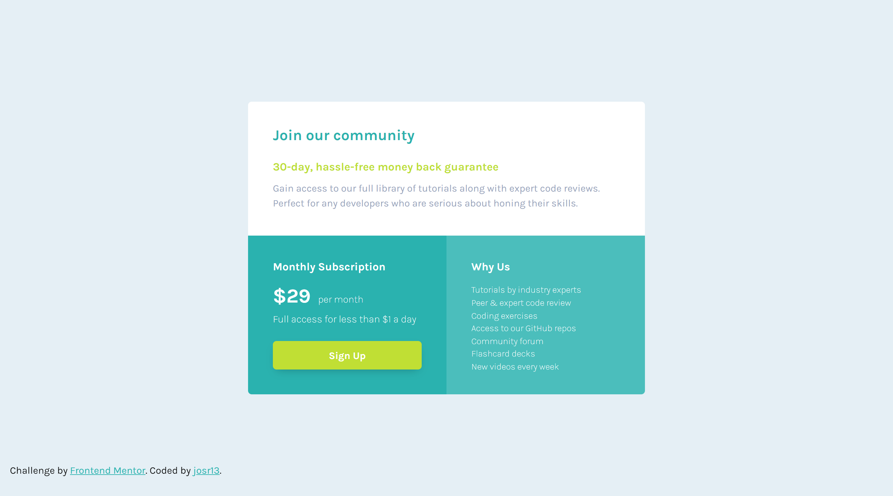

# Single price grid component

This is my solution to the [Single price grid component challenge on Frontend Mentor](https://www.frontendmentor.io/challenges/single-price-grid-component-5ce41129d0ff452fec5abbbc). Frontend Mentor challenges help you improve your coding skills by building realistic projects. 

## Table of contents

- [Overview](#overview)
  - [Screenshot](#screenshot)
  - [Links](#links)
- [My process](#my-process)
  - [Built with](#built-with)
  - [What I learned](#what-i-learned)
- [Author](#author)

## Overview

### Screenshot



### Links

- Solution URL: [Frontend Mentor](https://www.frontendmentor.io/solutions/responsive-single-price-grid-component-using-grid-sass-and-bem-ML0BZMnKma)
- Live Site URL: [GitHub Pages](https://josr13.github.io/single-price-grid-component)

## My process

### Built with

- Semantic HTML5 markup
- [Sass](https://sass-lang.com/) - CSS preprocessor
- CSS Grid
- Sass variables
- Sass partial files
- Mobile-first workflow
- BEM methodology

### What I learned

While working through this project, I learned the BEM methodology. 
```html
<div class="why">
  <h2 class="why__title">Why Us</h2>
  <ul class="why__list">
    <li class="why__item">Tutorials by industry experts</li>
  </ul>
</div>
```

## Author

- Website - [Joseph](https://josr13.github.io)
- Frontend Mentor - [@josr13](https://www.frontendmentor.io/profile/josr13)
